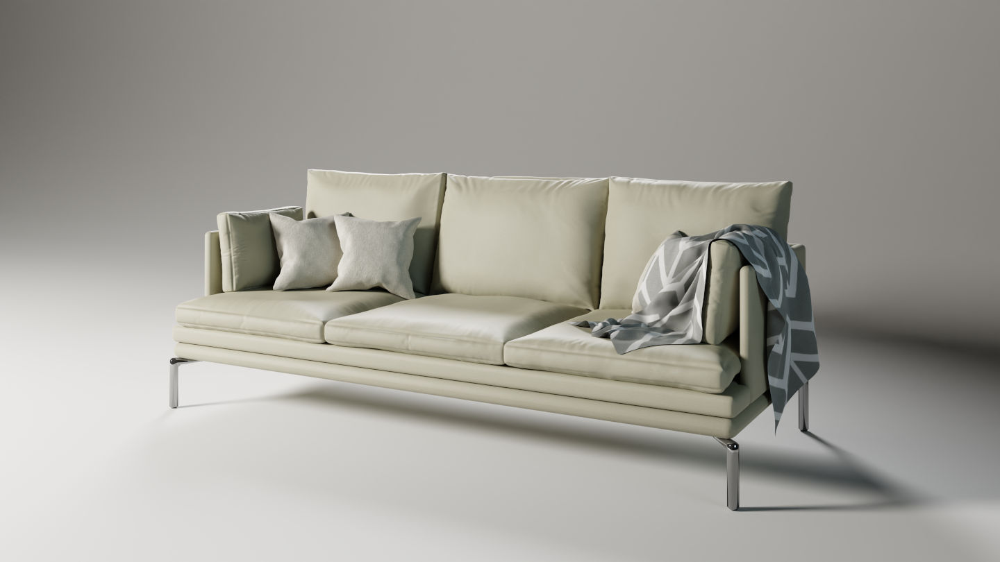

# Blender Couch Tutorial

A 3D model of a couch, roughly based on [Zanotta's William Couch](https://www.zanotta.it/en-us/products/sofas/william) made by following [Blender Guru's Couch Tutorial Series](https://www.youtube.com/watch?v=wb7yXRmAh0w&list=PLjEaoINr3zgGgS-N9Ews90bDAYYLoP0NO)

